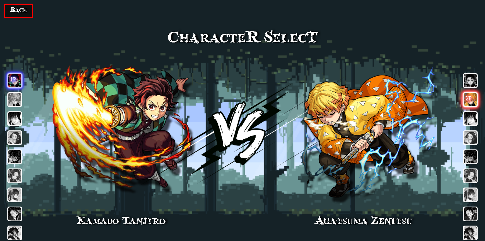

<h1 align="center">DemonSlayer-Game-Menu</h1>
<h3 align="center">Menu de jogo de luta com seleção de personagens</h3>

<h4 align="center"> 
	🚧  Em construção...  🚧
</h4>

 

### Sobre:
Esse é um projeto que desenvolvi durante o **#MAPADEV WEEK** do <a href="https://youtube.com/Dev em Dobro" target="_blank">**Dev em Dobro**</a>. O evento consistia em desenvolver um projeto de menu de seleção de personagens junto com os participantes, totalmente do zero.
 
Eu decidi escolher o tema do anime *Demon Slayer* e adicionar outras coisinhas :)

### 🛠 Tecnologias

As seguintes ferramentas foram usadas na construção do projeto:

- [HTML5]
- [CSS3]
- [JS]
### Futuras atualizações:

- [ ] Novas listas com mais personagens
- [ ] Animações ao escolher os personagens
- [ ] Música de fundo
- [ ] Sons ao escolher um personagem
